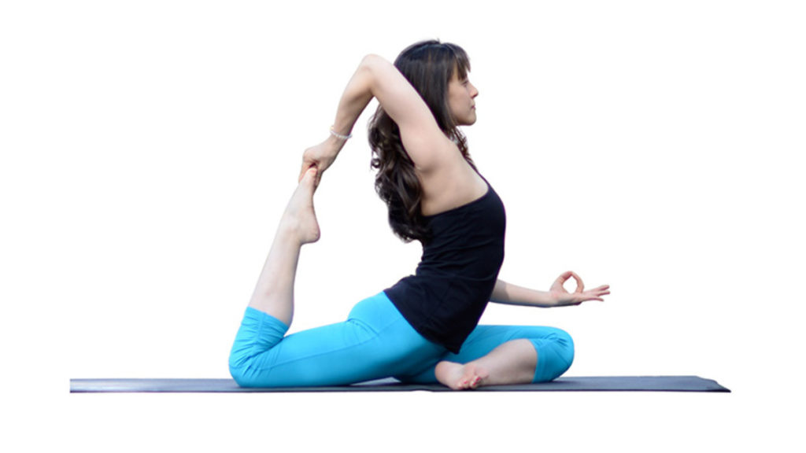

## Welcome to my website
This is the website where you can get all the yoga exercise. As you all know this the time we can give our time yo manitain our body and during this covid-19 , yoga is essential for our health. Yoga is a group of physical, mental, and spiritual practices or disciplines which originated in ancient India. Yoga is one of the six Āstika schools of Hindu philosophical traditions. There is a broad variety of yoga schools, practices, and goals in Hinduism, Buddhism, and Jainism.
## Benefits of yoga
Doing yoga offers many benefits for the body, mind and spirit and overall wellbeing, including:
increased flexibility
increased muscle strength and tone
improved respiration, energy and vitality
maintaining a balanced metabolism
weight reduction
cardio and circulatory health
improved athletic performance
protection from injury
## Yoga Style
The goal of yoga is unity of the body, mind and spirit with the focus on body posture, breathing and meditation. Several forms of yoga exist to meet the needs of varying lifestyles and personalities. Each yoga style emphasizes different positions and specific theories or beliefs. Some popular types are:
### The first one is Hatha Yoga – the basis of all styles that focuses on asanas or postures

### The second is Power Yoga – combines strength exercises, stretching and meditative breathing.

